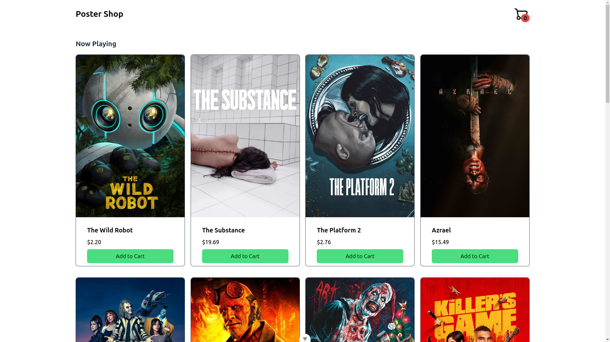
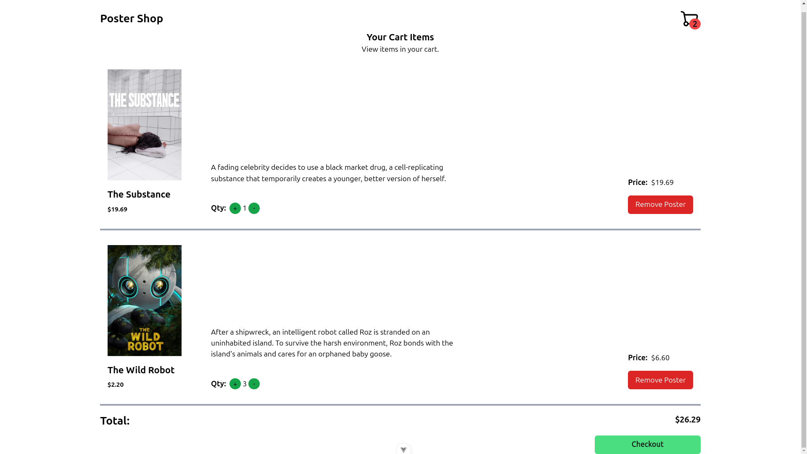

# [PosterShop](https://github.com/rahulrajdahal/PosterShop-vuejs). View and buy posters online

Buy movie posters.

- All movie posters
- Buy posters.

## Preview

[](https://github.com/rahulrajdahal/PosterShop-vuejs)


## 🏗 Development Guide

### 1. clone the repository

```sh
git clone https://github.com/rahulrajdahal/PosterShop-vuejs.git
```

### 2. Install Dependencies

#### npm

```sh
cd PosterShop-vuejs && npm install
```

### 3. Update Environment Variables

- Copy **.env.example** file.
- Update the environment variables.

### 4. Run development server

```sh
npm run dev
```

#### OR

### Run Production server

```sh
npm run start
```

## 🚀 Project Structure

Inside of project [PosterShop](https://github.com/rahulrajdahal/PosterShop-vuejs), you'll see the following folders and files:

```text
/
├── public/
│   └── favicon.svg
├── src/
|   ├── assets/
│   │   │── logo.svg
│   │   └── main.css
|   ├── components/
│   │   └── Component.vue
|   ├── router/
│   │   └── index.ts
|   ├── stores/
│   │   └── store.ts
|   ├── views/
│   │   └── View.vue
|   ├── App.vue
|   ├── main.ts
├── .env.example
├── index.html
├── tailwind.config.js
├── README.md
└── package.json
```

## 🧞 Commands

All commands are run from the root of the project, from a terminal:

| Command           | Action                                        |
| :---------------- | :-------------------------------------------- |
| `npm install`     | Installs dependencies.                        |
| `npm run dev`     | Starts local dev server at `localhost:5173`.  |
| `npm run build`   | Build your production site to `./dist/`.      |
| `npm run preview` | Preview your build locally, before deploying. |
| `npm run lint`    | Check all linting errors.                     |
